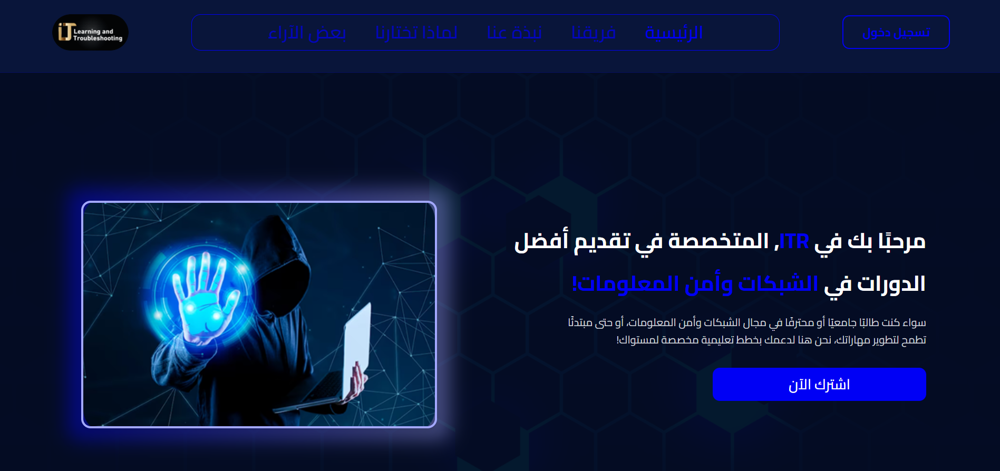
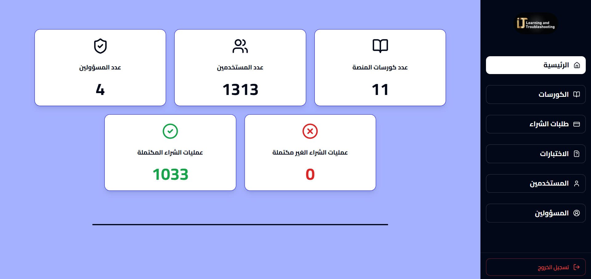
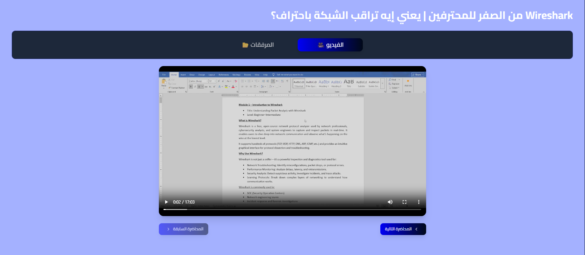
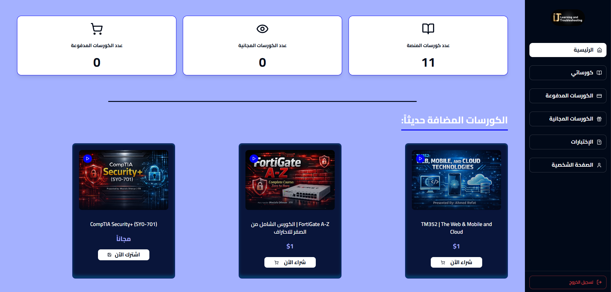
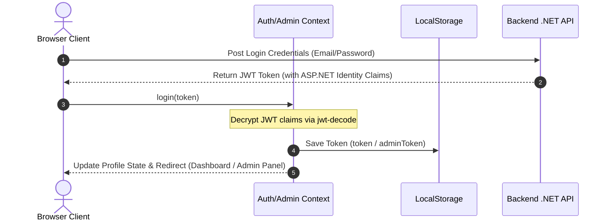

# ITR Education — Educational Platform

<div align="center">
  
  
  # 🎓 ITR Education
  ### منصة تعليمية متخصصة في الشبكات وأمن المعلومات ودورات الجامعة العربية المفتوحة
  
  **A premium, high-performance E-learning Platform tailored for Networking, Information Security, and Arab Open University (AOU) curricula.**
  
  [Official Website (موقعنا)](http://itr-learning.com/) • [YouTube Channel](https://youtube.com/@itlearningksa) • [Report Bug](mailto:support@itr-learning.com)

---

[](https://vitejs.dev/)
[](https://react.dev/)
[](https://www.typescriptlang.org/)
[](https://tailwindcss.com/)
[](https://ui.shadcn.com/)
[](https://opensource.org/licenses/MIT)

</div>

---

## 1. Project Title

**ITR Education** — The next-generation interactive learning platform designed to provide courses in Network Engineering, Cybersecurity, Systems, and specific courses for students of the Arab Open University (AOU).

---

## 2. Short Description

ITR Education is a comprehensive, responsive, right-to-left (RTL) Arabic E-learning web application built using modern web development standards. The application features a fully loaded Student Portal where learners can buy courses, stream lectures in adaptive resolutions, and undergo examination assessments. Simultaneously, it houses an Enterprise Admin Console enabling administrators to manage courses, uploads, users, exam pools, and verify student purchase receipts.

---

## 3. Demo / Preview

- **Production URL:** [http://itr-learning.com/](http://itr-learning.com/)
- **Staging/Vercel Deployments:** Configured automatically via Vercel integration.

---

## 4. Screenshots Section

Below is a preview of the platform's user interface and core dashboards.

|      **Landing Page & Hero Section**      |     **Student Learning Dashboard**     |
| :---------------------------------------: | :------------------------------------: |
|  |  |
|       **Adaptive HLS Video Player**       |  **Admin Dashboard & KPI Analytics**   |
|  |  |

---

## 5. Features

### 👤 Student/User Capabilities

- **Interactive Learning Dashboard:** View overall course progression, active classes, and exam results.
- **Course Discovery Storefront:** Filter, search, and navigate through _Free_ and _Paid_ courses.
- **Advanced HLS Video Player:** Adaptive streaming engine powered by `HLS.js` providing standard quality selections and cross-device video player aesthetics.
- **Academic Assessment Hub:** Dynamic quiz interface with timed tests, progress meters, interactive choices, and score reporting.
- **Student Profile Console:** Modify profile parameters and change account passwords using claims verification.

### 🔑 Administrator Capabilities

- **System Operations Panel:** Visual summaries displaying core analytics (total students, gross purchases, course engagement, admin logs).
- **Course & Lecture Editor (Full CRUD):** Create, update, or deprecate courses and link lecture quality links (HLS Stream Playlists).
- **Purchase Auditing Hub:** Approve or decline student requests to purchase courses, verifying payments manually.
- **Academic Quiz Builder:** Construct exams, assign test criteria, edit questions, and modify options for student assessment pools.
- **User & Staff Directory Control:** Manage the system admins list and student records.

---

## 6. Tech Stack

| Technology Layer          | Tool / Library Used                 | Purpose                                                                       |
| :------------------------ | :---------------------------------- | :---------------------------------------------------------------------------- |
| **Core Architecture**     | React v18 + TypeScript v5 + Vite    | High-performance client build & component-driven state structure.             |
| **Design System**         | Tailwind CSS + Shadcn UI + Radix UI | Beautiful Glassmorphism dark layout, native RTL alignment, and accessibility. |
| **Micro-Animations**      | Framer Motion                       | Fluid transitions, dynamic card entries, and sidebar slide events.            |
| **State & Data Fetching** | TanStack React Query v5             | Client-side cache synchronization and background query invalidation.          |
| **Media Engineering**     | HLS.js + Plyr CSS                   | Adaptive bitrate streaming and custom responsive video player wrappers.       |
| **Forms & Validation**    | React Hook Form + Zod               | Lightweight form state trackers and strict client-side schemas.               |
| **Backend Integration**   | .NET RESTful Web API                | Secured endpoints serving resources and authenticating JWT signatures.        |

---

## 7. Installation

Ensure you have [Node.js](https://nodejs.org/) installed (v18.x or above is highly recommended) and `npm` or `yarn`.

1. **Clone the Repository:**

   ```bash
   git clone https://github.com/yourusername/itr-education.git
   cd itr-education
   ```

2. **Install Dependencies:**

   ```bash
   npm install
   ```

3. **Establish Local Settings:**
   - Create a `.env` file in the root directory:
   ```bash
   cp .env.example .env
   ```

---

## 8. Environment Variables

To connect the frontend to the correct backend server instances, create a `.env` file in the root with the following parameters:

```env
# URL for the primary .NET REST API gateway
VITE_BASE_API=https://api.itr-learning.com/api

# Asset host URL for serving images and static server uploads
VITE_BASE_IMAGES=https://api.itr-learning.com/
```

> [!WARNING]
> Do not commit `.env` files to git. They are configured to be ignored by our `.gitignore` to prevent sensitive exposure of API directories.

---

## 9. Running the Project

### Development Mode

Runs the local dev server with hot module replacement (HMR):

```bash
npm run dev
```

Open your browser and navigate to `http://localhost:5173`.

### Production Build

Builds the app for production deployment, compiling TypeScript and assets to the `/dist` folder:

```bash
npm run build
```

### Preview Production Build

Locally test the built production files inside `/dist`:

```bash
npm run preview
```

### Code Quality Check

Executes ESLint to check for stylistic errors and syntax issues:

```bash
npm run lint
```

---

## 10. Folder Structure

The workspace is organized cleanly, keeping logical domains separate:

```
itr/
├── public/                  # Static assets and browser icon badges
├── src/
│   ├── assets/              # Compressed images, logos, and illustration resources
│   ├── components/
│   │   ├── ui/              # Shadcn primitive UI elements (Button, Card, Input)
│   │   ├── AdvancedPlayer/  # HLS.js adaptive player logic
│   │   ├── Navbar.tsx       # Landing responsive navigation header
│   │   └── ProtectedRoute.tsx # Route barrier for users/admins
│   ├── context/
│   │   ├── AuthContext.tsx  # User Auth state and local storage hooks
│   │   └── AdminAuthContext.tsx # Independent Admin Auth state context
│   ├── hooks/               # Custom global React hooks
│   ├── layouts/
│   │   ├── DashboardLayout.tsx # Standard layout wrapper for students
│   │   └── AdminLayout.tsx  # Admin dashboard sidebar configuration layout
│   ├── lib/
│   │   └── utils.ts         # Utility hooks (Shadcn merge helpers)
│   ├── pages/
│   │   ├── admin/           # Admin pages (Dashboard, Courses, Exams, Users CRUD)
│   │   ├── auth/            # Auth pages (Student & Admin logins, Register, Forgot Password)
│   │   ├── user/            # Student pages (MyCourses, ExamQuestions, Profile, LectureView)
│   │   ├── Index.tsx        # Main RTL Landing Page entry component
│   │   └── NotFound.tsx     # Animated 404 Route response page
│   ├── utils/               # Helper scripts
│   ├── App.tsx              # Main routing hub and providers mapping
│   ├── index.css            # Base stylesheet (Tailwind directives & variables)
│   └── main.tsx             # DOM injection file
├── .env                     # Local environment settings (Ignored)
├── .gitignore               # Clean standard git ignore definitions
├── package.json             # Workspace dependencies and commands
├── tailwind.config.ts       # Tailwind color extensions and spacing definitions
└── vite.config.ts           # Vite build configurations and path alias setups
```

---

## 11. API Endpoints

The frontend connects with a secured `.NET Web API`. Below is a breakdown of the primary endpoints utilized:

### 🔑 Authentication & Account

| Method | Endpoint                           |  Access Level   | Description                                        |
| :----: | :--------------------------------- | :-------------: | :------------------------------------------------- |
| `POST` | `/Account/Login`                   |     Public      | Authenticate a user and return a JWT bearer token. |
| `POST` | `/Account/Register`                |     Public      | Create a new student account.                      |
| `GET`  | `/Account/GetUserById?UserId={id}` | Student / Admin | Retrieve core profile variables.                   |
| `PUT`  | `/Account/ChangePassword`          | Student / Admin | Securely alter account credentials.                |

### 📚 Course Operations

|  Method  | Endpoint                         |   Access Level   | Description                                     |
| :------: | :------------------------------- | :--------------: | :---------------------------------------------- |
|  `GET`   | `/Courses/GetCourses`            | Public / Student | List all available catalog courses.             |
|  `GET`   | `/Courses/GetCourseDetails/{id}` |     Student      | Retrieve comprehensive syllabus & descriptions. |
|  `POST`  | `/Courses/AddCourse`             |      Admin       | Create a new course entry.                      |
| `DELETE` | `/Courses/DeleteCourse/{id}`     |      Admin       | Remove a course from the platform.              |

### 📝 Exam & Assessment Operations

| Method | Endpoint                             |  Access Level   | Description                                       |
| :----: | :----------------------------------- | :-------------: | :------------------------------------------------ |
| `GET`  | `/Exams/GetExamsByCourse/{courseId}` | Student / Admin | Retrieve exams associated with a course.          |
| `POST` | `/Exams/SubmitExamAnswers`           |     Student     | Submit dynamic test choices for grading.          |
| `POST` | `/Exams/AddQuestion`                 |      Admin      | Add new multiple-choice questions to a quiz pool. |

---

## 12. Authentication Flow

ITR Education maintains strict session integrity across separate User and Admin sub-domains:



> [!NOTE]
> The claims extraction processes system-level keys (`http://schemas.microsoft.com/ws/2008/06/identity/claims/role`) to ensure role authorization checks match target layout routes.

---

## 13. Deployment

This project is configured for deployment on **Vercel** but can be deployed on any static web hosting platform (Netlify, AWS S3, Hostinger, etc.).

### Deploying to Vercel

1. Ensure your `vercel.json` exists in the root directory to handle client-side routing rewrites for Single Page Applications (SPA):
   ```json
   {
     "rewrites": [{ "source": "/(.*)", "destination": "/index.html" }]
   }
   ```
2. Link your repository in Vercel.
3. Configure the **Build Settings**:
   - Build Command: `npm run build`
   - Output Directory: `dist`
4. Add the Environment Variables:
   - `VITE_BASE_API` and `VITE_BASE_IMAGES`.

---

## 14. Future Improvements

- **Automated Payments Integration:** Secure checkout gateways (Stripe, MyFatoorah, HyperPay) for automated instant enrollments.
- **Certificate Generation:** Automated generation of completion certificates using custom canvas drawing helpers.
- **Dynamic Dark/Light Mode:** Full integration of system themes across dashboards.
- **Push Notifications:** Instant pop-up reminders for upcoming live session times.
- **Mobile Application:** Porting the core codebase to React Native for high-performance iOS and Android capabilities.

---

## 15. Contributing

We welcome contributions from fellow engineers! To contribute:

1. **Fork** the project.
2. **Create** your feature branch: `git checkout -b feature/NewAesthetics`
3. **Commit** your updates: `git commit -m 'Add custom micro-interactions'`
4. **Push** to the branch: `git push origin feature/NewAesthetics`
5. **Open** a Pull Request for code auditing.

---

## 16. License

This codebase is released under the **MIT License**. For complete documentation, please check the [LICENSE](LICENSE) file.

---

## 17. Contact Information

- **Lead Developer / Author:** [ITR Education Team](http://itr-learning.com/)
- **YouTube:** [@itlearningksa](https://youtube.com/@itlearningksa)
- **Instagram:** [@mostafa_othman_20](https://www.instagram.com/mostafa_othman_20)
- **Facebook Page:** [ITR Learning Social](https://www.facebook.com/share/15Hwhy44ic/)

<div align="center">
  <sub>صنع بحب وشغف لدعم مسيرة التعلم والتقدم التقني 🚀</sub>
</div>
"# itr-learning-platform"
